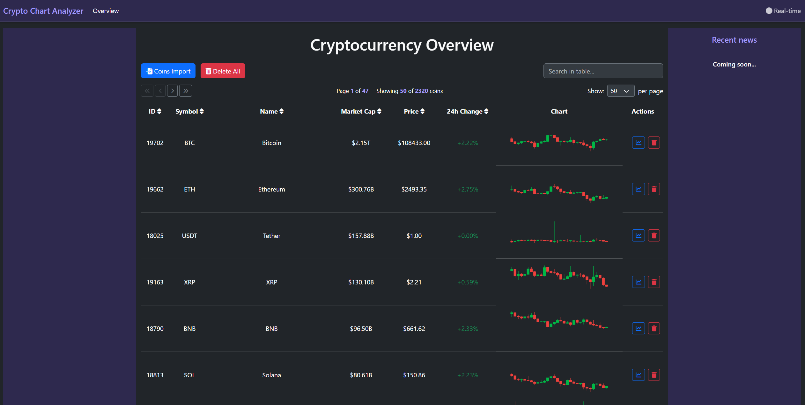

<div align="center">

<h2> CryptoMarketHub </h2>

[](https://github.com/MrCr1p3r/crypto-market-hub/actions/workflows/ci.yml)
[](https://codecov.io/gh/MrCr1p3r/crypto-market-hub)
[](https://github.com/MrCr1p3r/crypto-market-hub/blob/main/LICENSE)
[](https://dotnet.microsoft.com/)
[](https://www.typescriptlang.org/)

</div>

## 🚀 Overview

CryptoMarketHub is a **high-performance cryptocurrency market data platform** built with modern .NET 8 microservices architecture. It aggregates, processes, and visualizes real-time market data from multiple exchanges, providing users with a unified interface for comprehensive cryptocurrency market analysis.

The platform handles **2000+ trading pairs** across major exchanges (Binance, Bybit, MEXC) while maintaining real-time WebSocket connections and providing interactive dashboards for market monitoring and analysis.

## ✨ Key Features

- **🔥 Real-Time Data Streaming**  
  Live market updates delivered instantly to connected clients via SignalR, enabling live market data updates

- **🌐 Multi-Exchange Aggregation**  
  Unified API layer aggregating data from Binance, Bybit, MEXC, and CoinGecko with normalized data structures

- **📊 Interactive Analytics Dashboard**  
  Advanced filtering, sorting, and pagination with TanStack Table for analyzing 2000+ trading pairs

- **📈 Advanced Chart Visualization**  
  Interactive candlestick charts with multiple timeframes, technical indicators, and zoom capabilities

- **⚡ Enterprise-Grade Performance**  
  Redis caching, lazy loading, and bulk operations optimized for high-frequency data processing

- **🔄 Asynchronous Messaging**  
  RabbitMQ-powered event-driven architecture enabling reliable inter-service communication and background job processing

- **🏗️ Microservices Architecture**  
  Scalable distributed services orchestrated by .NET Aspire

## 🎬 Demo

### **📊 Main Dashboard**

*Comprehensive cryptocurrency market overview with real-time data from multiple exchanges*

### **📈 Interactive Charts**

*Advanced candlestick charts with multiple timeframes and technical analysis capabilities*

### **🔥 Real-Time Updates**

*Live market data streaming via SignalR - watch prices update in real-time*

### **🏗️ .NET Aspire Orchestration**

*Distributed service architecture managed by .NET Aspire with integrated infrastructure*

## 🛠️‍💻 Tech Stack

### **🏗️ Backend & Infrastructure**
- **.NET 8:** Modern C# with ASP.NET Core for building scalable microservices
- **.NET Aspire:** Cloud-native orchestration and service discovery
- **Entity Framework Core:** ORM for SQL databse
- **SignalR:** Real-time bidirectional communication between server and clients
- **RabbitMQ:** Message queue system for asynchronous communication between services

### **🗄️ Database & Caching**
- **MSSQL:** Primary database for persistent data storage and complex queries
- **Redis:** High-performance in-memory caching layer for optimizing data retrieval

### **🎨 Frontend**
- **TypeScript:** Type-safe frontend development with modern ES6+ features
- **ApexCharts:** Modern charting library for interactive candlestick charts and data visualization
- **TanStack Table:** Advanced table functionality with filtering, sorting, and pagination

### **⚙️ DevOps**
- **GitHub Actions:** Automated CI pipeline for building and testing 
- **Docker:** Containerization for consistent development, integration testing, and deployment environments

## 🚀 Getting Started

### Option 1: GitHub Codespaces (Recommended)
[](https://codespaces.new/MrCr1p3r/crypto-market-hub)

Once your codespace is ready, run the application using:
```bash
dotnet run --no-build --project ./src/Aspire/CryptoMarketHub.AppHost/ --launch-profile http
```

### Option 2: Dev Container (VS Code)

1. **Install prerequisites:**
   - [VS Code](https://code.visualstudio.com/) and [Docker Desktop](https://www.docker.com/products/docker-desktop)
   - [Dev Containers extension](https://marketplace.visualstudio.com/items?itemName=ms-vscode-remote.remote-containers)

2. **Clone and open:**
   ```bash
   git clone https://github.com/MrCr1p3r/crypto-market-hub.git
   cd crypto-market-hub
   ```
   
3. **Open in VS Code and click "Reopen in Container" when prompted**

4. **Run the application:**
   ```bash
   dotnet run --no-build --project ./src/Aspire/CryptoMarketHub.AppHost/ --launch-profile http
   ```

## 📖 Usage

Web UI:

- 🌐 **Web App:** http://localhost:5000/overview
- 📊 **Aspire Dashboard:** http://localhost:15120

> **💡 Aspire Dashboard Login:** If the dashboard doesn't auto-login, copy the token URL from the terminal output (e.g., `http://localhost:15120/login?t=<token>`) and paste it into your browser.

> In GitHub Codespace, check the forwarded port URLs under the Ports panel.

## 🐛 Issues

If you encounter any issues while using or setting up the project, please check the [Issues](https://github.com/MrCr1p3r/crypto-market-hub/issues) section to see if it has already been reported. If not, feel free to open a new issue detailing the problem.

When reporting an issue, please include:

- A clear and descriptive title.
- A detailed description of the problem.
- Steps to reproduce the issue.
- Any relevant logs or screenshots.
- The environment in which the issue occurs (OS, browser, .NET version, etc.).

## 📜 License

This project is licensed under the MIT License - see the [LICENSE](LICENSE) file for details.

---

<div align="center">

**🔗 Let's Connect:**

**LinkedIn**: [Yehor Tonkyi](https://linkedin.com/in/yehor-tonkyi-0b97b6265/) <br>
**GitHub**: [MrCr1p3r](https://github.com/MrCr1p3r) <br>
**Email**: yehor.tonkyi@gmail.com

</div>
